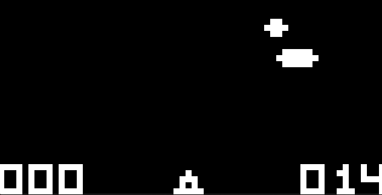
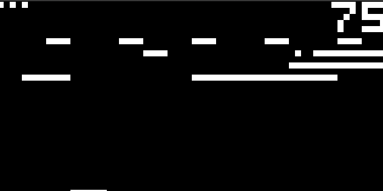

# Chip 8 Emulator

Chip 8 emulator written in Rust as language learning exercise.

## Dependencies

* [SDL2](https://github.com/Rust-SDL2/rust-sdl2)
    For input handling and rendering.
* [rodio](https://github.com/RustAudio/rodio)
    For noise generation.

## Screens

All roms came from [here](https://github.com/dmatlack/chip8/tree/master/roms).

UFO

Breakout

Space Invaders
